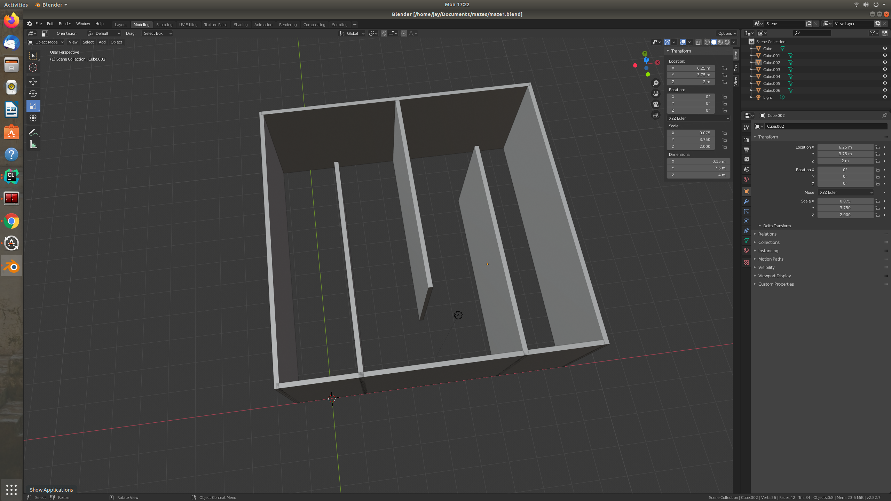
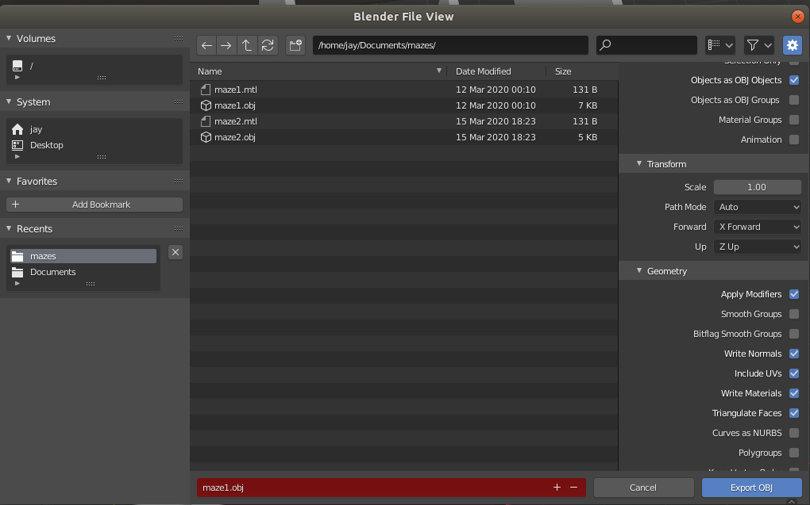
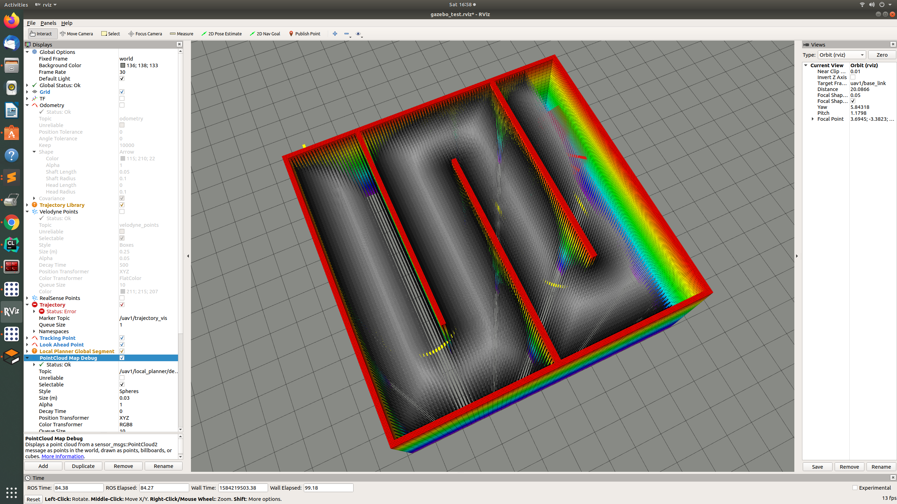

## Dependencies
`sudo apt-get install ros-melodic-octomap ros-melodic-octomap-msgs ros-melodic-octomap-rviz-plugins ros-melodic-dynamic-edt-3d`

## Preprocessing

For the offline octomaps, use `octomap.launch` to publish the octomap binary as a ros message. Change the file path accordingly. 
### Steps to convert from .blend to .bt

1. Use blender to generate any environment that you like. 



2. Export the blender file as a `.obj` file using the options below 



3. Use the following to convert `.obj` to `.bt`
```
sudo chmod +x binvox 
sudo chmod +x convert.sh
./convert.sh filename.obj
``` 

4. Debug: Enabling the debug parameter publishes a point cloud with the distance transform



### Maintainer
Jay Patrikar jaypat@cmu.edu