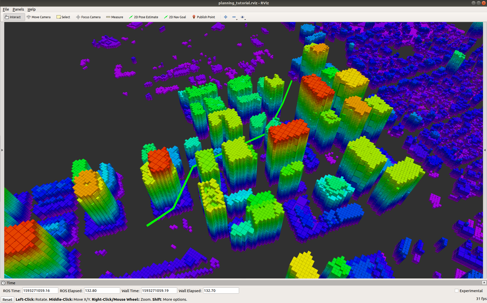
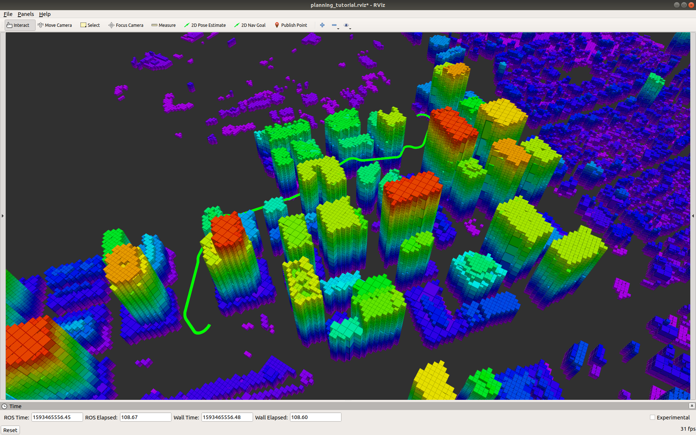

# OMPL Planning Tutorial

This tutorial shows how to set up a basic and advanced path planner using the OMPL library. It will go over how to set up the workspace, setting up the required packages, running the example code, a code walkthrough, and exercises to help better understand the concepts and code.

## SSH-Key

Before you begin please set-up ssh-keys for bitbucket:
https://support.atlassian.com/bitbucket-cloud/docs/set-up-an-ssh-key/

# Setup

There are two principal ways to get setup:

1. "Bare metal" installation where you install the packages directly to your computer.
2. Docker setup where you run and develop inside a docker container.

To be able to quickly run through the exercise it is recommended that you use the docker method. Please choose the branch corresponding to the ROS version.

## Docker setup (Recommended to get started quickly)

This approach should work in Linux, Mac, and Windows but has only been tested on Linux and Mac systems so far.

Instructions:

- Install docker: https://docs.docker.com/get-docker/
- Open a terminal.
- Get `x11vnc_desktop` script, make the script executable, and run the setup by executing this command:

```bash
    wget https://bitbucket.org/castacks/core_planning_tutorial/raw/ccfa5112a711936471f1aad3b14386ac30f611cc/dockerconfig/x11vnc_desktop.py && chmod +x x11vnc_desktop.py
```

- Run the desktop (this can take a while to download the first time)

```bash
    ./x11vnc_desktop.py --image smash0190/core_planning_tutorial:v3
```

- Either a browser with the desktop will open automatically or you have to open the url shown in the command line. Usually it will look something like this:

```bash
    http://localhost:6080/vnc.html?resize=downscale&autoconnect=1&password=kx112Rge
```

- Go to the browser and you should be able to work on your exercises. Proceed in the tutorial as below. Things might be a bit slow depending on your machine. The workspace is located here: `/tutorial_ws`
- Here is for example one quick example that can be executed by typing in the terminal that is visible in the browser:

```bash
    cd /tutorial_ws/
    roscore &
    mon launch core_planning_tutorial plan.launch
```

- Three code editors are installed: `code` (Microsoft Visual Code), `emacs`, and `vi`.
- To shutdown `ctrl-c` in the original terminal

## "Bare metal" install (More work, better if you want to develop based on this later)

### Dependencies

We are using Ubuntu 18.04 and ROS Melodic.

Install the necessary packages as follows:

```bash
sudo apt-get install ros-melodic-octomap ros-melodic-octomap-msgs ros-melodic-octomap-rviz-plugins ros-melodic-dynamic-edt-3d  ros-melodic-rosmon python-catkin-tools
```

### Install vcstool

In order to more easily set up the workspace, install vcstool with the following:

```bash
sudo sh -c 'echo "deb http://packages.ros.org/ros/ubuntu $(lsb_release -sc) main" > /etc/apt/sources.list.d/ros-latest.list'
sudo apt-key adv --keyserver hkp://pool.sks-keyservers.net --recv-key 0xAB17C654
sudo apt-get update
sudo apt-get install python3-vcstool
```

### Setup

Now we will set up the workspace:

```bash
mkdir -p ~/tutorial_ws/src
cd  ~/tutorial_ws/src
git clone git@bitbucket.org:castacks/core_planning_tutorial.git
cp core_planning_tutorial/planning_tutorial.repos .
vcs import < planning_tutorial.repos
cd ../
catkin build
```

# Basic OMPL Planning

## Executing the Example

Our example code is in `src/planning_tutorial.cpp`, which we will go over in the following section. To run this example, source the `setup.bash` file, start roscore, and run the executable.

```bash
source devel/setup.bash
roscore & mon launch core_planning_tutorial plan.launch
```

You will see RViz launch and the octomap of a city displayed. After a few seconds a green planned path will be displayed. This path connects a start and end state while avoiding the obstacles. What you will see is seen in the following picture. The planner will repeatedly find new paths, and each will look different and have a different cost.



Looking at the outputs in the terminal, you can see that it finds an initial solution and outputs the cost. After the alloted time is up, it outputs the cost of the final solution.

## Code Walkthrough

For our obstacles, we are using using an obstacle map of a city and is loaded as `map = map_representation_loader.createInstance(map_representation);`.

The bounds for the OMPL planner are set as the minimum and maximums of the obstacles in `map`

```C++
map->getLowBounds(x,y,z);
bounds.setLow(0, x);
bounds.setLow(1, y);
bounds.setLow(2, z);

map->getHighBounds(x,y,z);
bounds.setHigh(0, x);
bounds.setHigh(1, y);
bounds.setHigh(2, z);

si_xyzpsi = GetStandardXYZPsiSpacePtr();
si_xyzpsi->getStateSpace()->as<XYZPsiStateSpace>()->setBounds(bounds);
```

We then tell the planner how we want it to check for collisions using our custom `isvalid` function

```C++
si_xyzpsi->setStateValidityCheckingResolution(1.0/si_xyzpsi->getMaximumExtent());
si_xyzpsi->setStateValidityChecker(std::bind(&PlanningTutorial::isvalid,this, std::placeholders::_1));
si_xyzpsi->setup();
```

The objective function is set as to minimize the path length

```C++
pdef = std::make_shared<ob::ProblemDefinition>(si_xyzpsi);
pdef->setOptimizationObjective(ob::OptimizationObjectivePtr(new ob::PathLengthOptimizationObjective(si_xyzpsi)));
```

The start and goal state are set using the `getStartState` and `getGoalState` functions. In the example case they are set to (-834, -437, 50) and (-1553, -390, 50) respectively.

```C++
auto start = getStartState();
auto goal = getGoalState();
pdef->setStartAndGoalStates(start,goal);
```

For this example we use an RRT\* planner

```C++
auto planner = std::make_shared<og::RRTstar>(si_xyzpsi);
planner->setProblemDefinition(pdef);
planner->setup();
```

Now everything is set and ready to go! The planner searches for a path in

```C++
auto solved = planner->solve(30.0); // seconds
```

The input to the function `solve` is the alloted maximum time for the planner to find its best path. In this case it is allowed to run for 30 seconds.

## Exercises

### Exercise 1: Solve Time

First, lets run the example RRT\* with `mon launch core_planning_tutorial plan.launch`. Every 30 seconds the planner will find a new path. In the terminal, it will output the path cost of the initial solution and the final solution, such as the following:

```
   planning_tutorial: Info:    RRTstar: Started planning with 1 states. Seeking a solution better than 0.00000.
   planning_tutorial: Info:    RRTstar: Initial k-nearest value of 83
   planning_tutorial: Info:    RRTstar: Found an initial solution with a cost of 1427.44 in 10 iterations (3 vertices in the graph)
   planning_tutorial: Info:    RRTstar: Created 8544 new states. Checked 8010121 rewire options. 1 goal states in tree. Final solution cost 805.571

```

Notice how the final path costs fluctuate between the various final solutions but stay in roughly the same range of values.

Now modify the amount of time the planner is given to find its best solution:

```C++
auto solved = planner->solve(10.0); // seconds
```

Notice how now the final paths look very different on each iteration and the final cost fluctuates immensely. This is because we are giving the planner less time to find an optimal solution.

You can also explore this in the opposite direction, where you give the planner a lot of time to find the optimal solution.

### Exercise 2: RRT-Connect

We will now try a different planner called RRT-Connect. Replace the RRT\* planner with RRT-Connect as follows:

```C++
// Define the type of planner
// auto planner = std::make_shared<og::RRTstar>(si_xyzpsi);
auto planner = std::make_shared<og::RRTConnect>(si_xyzpsi);
```

The first thing you will notice in the solve time for RRT-Connect is much faster. This is because it is a feasible planner, meaning that it terminates once any feasible path is found. The method builds an RRT at the start and goal states and explore toward each other using a greedy heuristic.

You will also notice that the path costs fluctuate a lot, and the paths themselves are very simple and don't look optimal.

### Exercise 3: BIT\*

The last planner we will implement is the BIT\* planner:

```C++
// Define the type of planner
// auto planner = std::make_shared<og::RRTstar>(si_xyzpsi);
auto planner(std::make_shared<og::BITstar>(si_xyzpsi,"kBITstar"));
```

Keep the solve time at 10 seconds in order to compare the results to RRT\*.
Notice how the results for BIT\* with 10 seconds of solve time looks very
similar to RRT\* when it has 30 seconds of solve time. Why does BIT\* perform better?
BIT\* combines graph-based and sampling-based planning methods by searching through increasingly dense sets of randomly samples points.
This allows BIT\* to converge toward the optimal path faster.

### Other Exercises

- Change the start or goal state to see how it affects solve time and path quality.
- Try other OMPL planners by including them in the header file and modifying the planner accordingly: [OMPL Planners](https://ompl.kavrakilab.org/planners.html)

# Advanced OMPL Planning

For the advanced OMPL planning portion, we will be implementing a BIT\* planner with Trochoidal paths.

## Setup

The setup for the advanced planning is the same as for the Basic tutorial. All you need to do is switch to the advanced branch of the `core_planning_tutorial` repository and build the code through the following:

```bash
cd ~/tutorial_ws/src/core_planning_tutorial/
git pull
git checkout advanced_dubins
cd ../../
catkin build
```

## Executing the Example

The example code is in `src/planning_tutorial.cpp`. Run the example in the same manner as the Basic tutorial:

```bash
source devel/setup.bash
roscore & mon launch core_planning_tutorial plan.launch
```

You will see RViz launch and the octomap of a city displayed. After a few seconds a green planned path will be displayed. This path connects a start and end state while avoiding the obstacles. What you will see is seen in the following picture. The planner will repeatedly find new paths, and each will look different and have a different cost.



A clear difference in this planner as compared to the basic tutorial planners is the paths are not straight segments but rather trochoidal paths.

## Code Walkthrough

For our obstacles, we are using using an obstacle map of a city and is loaded as map = map_representation_loader.createInstance(map_representation);.

The bounds for the OMPL planner are set as the minimum and maximums of the obstacles in map, while extending the ceiling to 100:

```C++
map->getLowBounds(x,y,z);
bounds.setLow(0, x);
bounds.setLow(1, y);
bounds.setLow(2, z);

map->getHighBounds(x,y,z);
bounds.setHigh(0, x);
bounds.setHigh(1, y);
bounds.setHigh(2, 100);

si_xyzpsi = GetStandardXYZPsiSpacePtr();
si_xyzpsi->getStateSpace()->as<XYZPsiStateSpace>()->setBounds(bounds);
```

We then set the validator for states and motion, thus checking reachability and collisions:

```C++
si_xyzpsi->setStateValidityChecker(std::bind(&PlanningTutorial::isvalid,this,std::placeholders::_1));
ompl::base::MotionValidatorPtr MoValid(new trochoids::TMotionValidator(si_xyzpsi));
si_xyzpsi->setMotionValidator(MoValid);
```

In this case, rather than states being connected as straight lines, they are connected using trochoidal paths (which because there is no wind is just Dubins paths).

The objective function is set to minimize the path length:

```C++
pdef = std::make_shared<ob::ProblemDefinition>(si_xyzpsi);
ompl::base::OptimizationObjectivePtr obj(new trochoids::TObjective(si_xyzpsi));
pdef->setOptimizationObjective(obj);
```

The start and goal state are set using the getStartState and getGoalState functions. In the example case they are set to (-834, -437, 50) and (-1553, -390, 50) respectively.

```C++
auto start = getStartState();
auto goal = getGoalState();
pdef->setStartAndGoalStates(start,goal);
```

Then finally the planner is set, which in this case is BIT\*.

```C++
auto planner(std::make_shared<og::BITstar>(si_xyzpsi,"kBITstar"));
planner->setProblemDefinition(pdef);
planner->setup();
```

You're all set! Now we solve for a path between the two states.

```C++
auto solved = planner->ob::Planner::solve(100.0);; // seconds
```

In this case, we are allowing the planner to run for 100 seconds. This is much longer than the previous planners, but because of the motion validation, it is harder to find the optimal path.

## Exercises

- Modify allowed solve time
- Modify the objective function
- Modify the start and end states
- Get creative. Feel free to create your own exercises and add them to the repo.
- Add custom obstacles to the map using the [shapes repo](https://bitbucket.org/castacks/shapes/src/master/).

## Maintainer

Jay Patrikar (jaypat@cmu.edu), Brady Moon (bradym@andrew.cmu.edu), Yaoyu Hu (yaoyuh@andrew.cmu.edu) and Sebastian Scherer (basti@cmu.edu)

## Instructions for rebuilding the docker image (Should not be required unless the base is required to change)

The docker image is already built and available on dockerhub. However if changes are required the docker image can be rebuilt as follows. It can be pushed anywhere on dockerhub but below it is pushing to Basti's account:

```
cd dockerconfig
docker build -t smash0190/core_planning_tutorial:vXX .
docker push smash0190/core_planning_tutorial:vXX

```

To change the config please take a look at the file in

```
dockerconfig/Dockerfile
```
